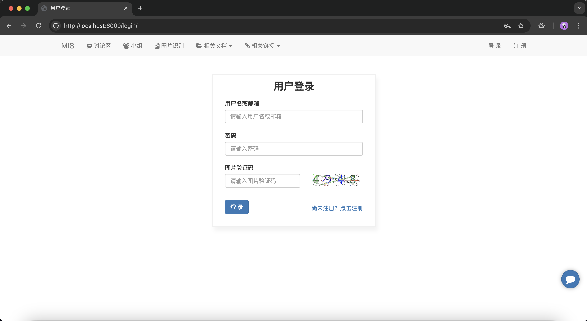

<p align="center">
  <a title="License" target="_blank" href="https://github.com/isKage/mis/blob/main/LICENSE"></a>
  <a title="GitHub Commits" target="_blank" href="https://github.com/isKage/mis/commits/main"></a>
  <br><br>
  <a title="GitHub Watchers" target="_blank" href="https://github.com/isKage/mis/watchers"></a>  
  <a title="GitHub Stars" target="_blank" href="https://github.com/isKage/mis/stargazers"></a>  
  <a title="GitHub Forks" target="_blank" href="https://github.com/isKage/mis/network/members"></a>  
</p>

# MIS（管理信息系统）：校园AI助手

[lang: EN](./README_en.md)

## 1. 项目简介

该项目基于`Python3.9`，使用`Django`和`Mysql`构建。

在使用`YOLOV5`网络时，您需要安装一些数据分析相关的库。

## 2. 安装步骤

首先，在`Terminal`中创建一个新文件夹
```text
mkdir newfile
```

然后进入该文件夹
```text
cd newfile
```

接下来，克隆该项目到当前目录
```text
git clone git@github.com:isKage/mis.git
```

进入项目根目录
```text
cd mis
```

## 3. 安装依赖

注意：该项目依赖于`Python3.9`
```text
pip install -r requirements.txt
```

## 4. Mysql 设置

在 mis 目录下创建一个`local_settings.py`文件，并进行如下设置：
```python
# 设置语言
LANGUAGE_CODE = 'zh-hans'

# Mysql 设置
DATABASES = {
    'default': {
        'ENGINE': 'django.db.backends.mysql',
        'NAME': 'mis',  # 使用你自己的数据库名称
        'USER': 'root',  # 数据库用户
        'PASSWORD': '******',  # 数据库密码
        'HOST': '127.0.0.1',  # 本地数据库
        'PORT': '3306',  # 默认端口
    }
}
```

接下来，运行以下命令创建数据表：
```text
python3 manage.py makemigrations
python3 manage.py migrate
```

## 5. 启动项目

在`Terminal`中运行以下命令：
```text
python3 manage.py runserver
```
然后，在浏览器中打开如下链接，若在本地运行：

> http://localhost:8000/

## 6. 网页展示

### 6.1 登陆界面


### 6.2 话题列表


文章发布与 AI 内容总结


### 6.3 学习小组


### 6.4 消息界面


### 6.5 AI Bot 网站人工智能助手
